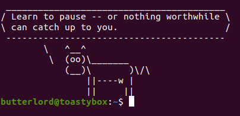

# Ace Cassidy's Dotfiles

A sensible and minimal set of configurations optimized for debian/ubuntu



Star if you find these files useful, fork if you would like to make these dotfiles your own :-)

## Installation

```bash
cd ~
git clone https://github.com/Ace-Cassidy/dotfiles.git
cd dotfiles
stow <configuration>
```

To install a configuration simply execute ```stow <configuration>``` from within the dotfiles directory.

For example ```stow bash``` will create symlinks in ```~``` for ```.bash_aliases``` and ```.bash_profile```

More generally ```stow <folder>``` creates symlinks for everything inside the specified folder, into the parent directory of your current working directory.

## Why isn't it working

Make sure you have installed GNU stow with ```sudo apt install stow```

this repo must be cloned to ~ for stow to function as shown in the above example. if you wish to clone elsewhere use ```stow --target=~ <configuration>``` from within the cloned ``dotfiles`` directory.

If a file already exists (such as ```.bash_aliases```) then stow will fail with a conflict warning. This is the desired behavior so that existing configuration is not lost. If you wish to overwrite an existing configuration you must manually delete the existing files (or rename them as eg ```.bash_aliases.bak```) and rerun stow.

## Configurations

### bash

Some parts of the .bashrc configuration (such as cowsay/fortune) require running ```install_bashrc_commands``` in order to function. To view/edit which commands will be installed examine the bottom of ```.bash_aliases```

### git

Make sure to change the name and email to your own name and email!!!

### vim

Adds a minimal ```.vimrc``` and includes the solarized color scheme ```.vim/colors/solarized.vim```

### vscode

vscode files are located in ```~/.config/Code/User```. You will need to delete your existing vscode settings.json before stow will work. Alternatively you may manually copy and paste the lines you would like. It is recommended to have run vscode at least once before the stow so that the whole path is not symlinked.

### xmodmap

xmodmap will overload capslock to function as escape when pressed, and when held will provide arrow keys on the right hand home row. To change from inverted-T to vim style arrows edit the .xmodmap file.

Note: you will need to make the script executable using ```chmod +x .xmodmap.sh```, and then install the dependency xcape with ```sudo apt install xcape``` before running stow. You will need to log out or restart before the keybindings take effect
